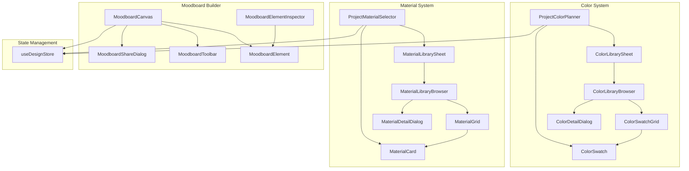

# Phase 2A Component Architecture

> **Purpose:** Show how Phase 2A components connect and interact. Use this document as Cursor prompt context when building or modifying components.

---

## Table of Contents

1. [Overview](#overview)
2. [Color System Components](#color-system-components)
3. [Material System Components](#material-system-components)
4. [Moodboard Builder Components](#moodboard-builder-components)
5. [State Management Architecture](#state-management-architecture)
6. [Component Dependencies](#component-dependencies)
7. [shadcn/ui Component Usage](#shadcnui-component-usage)

---

## Overview

Phase 2A consists of three interconnected systems:

```
┌─────────────────────────────────────────────────────────────────┐
│                     Phase 2A: Design Intelligence                │
├─────────────────────┬─────────────────────┬─────────────────────┤
│   Color System      │   Material System   │   Moodboard Builder │
│                     │                     │                     │
│ • Color Library     │ • Material Catalog  │ • Canvas Editor     │
│ • Color Planner     │ • Material Selector │ • Element Library   │
│ • Palette Generator │ • Cost Calculator   │ • Export/Share      │
└─────────────────────┴─────────────────────┴─────────────────────┘
                              │
                              ▼
                    ┌─────────────────┐
                    │  Design Store   │
                    │    (Zustand)    │
                    └─────────────────┘
                              │
                              ▼
                    ┌─────────────────┐
                    │   Supabase DB   │
                    │  (via API)      │
                    └─────────────────┘
```

---

## Color System Components

### Component Hierarchy

```
src/components/design/
├── color-swatch.tsx
│   ├── ColorSwatch           # Single color swatch (presentational)
│   └── ColorSwatchGrid       # Grid of color swatches
│
├── color-library-browser.tsx
│   ├── ColorLibraryBrowser   # Main browser with filters
│   └── ColorLibrarySheet     # Sheet variant for inline selection
│
├── color-detail-dialog.tsx
│   └── ColorDetailDialog     # Full color details modal
│
└── project-color-planner.tsx
    └── ProjectColorPlanner   # Room-by-room color selection
```

### ColorSwatch

**File:** `src/components/design/color-swatch.tsx`

**Purpose:** Display a single color swatch with optional label and actions.

**Props Interface:**
```typescript
interface ColorSwatchProps {
  color: Color
  size?: 'sm' | 'md' | 'lg' | 'xl'     // Swatch size
  selected?: boolean                     // Selection highlight
  showName?: boolean                     // Display color name
  showCode?: boolean                     // Display color code (e.g., SW 7005)
  showActions?: boolean                  // Show favorite/info buttons
  onClick?: (color: Color) => void       // Selection callback
  onFavorite?: (color: Color) => void    // Favorite toggle
  onInfo?: (color: Color) => void        // Open detail dialog
  className?: string
}
```

**Usage Example:**
```tsx
<ColorSwatch
  color={color}
  size="lg"
  selected={selectedId === color.id}
  showName
  showCode
  onClick={handleColorSelect}
/>
```

**Dependencies:**
- `@/types/design` → `Color` type
- `@/components/ui/tooltip`
- `@/components/ui/button`

---

### ColorSwatchGrid

**File:** `src/components/design/color-swatch.tsx`

**Purpose:** Display multiple color swatches in a responsive grid.

**Props Interface:**
```typescript
interface ColorSwatchGridProps {
  colors: Color[]
  selectedIds?: string[]
  favoriteIds?: string[]
  onSelect?: (color: Color) => void
  onFavorite?: (color: Color) => void
  onInfo?: (color: Color) => void
  columns?: 4 | 6 | 8 | 10             // Grid columns
  swatchSize?: 'sm' | 'md' | 'lg'
  showNames?: boolean
  showCodes?: boolean
  className?: string
}
```

**Usage Example:**
```tsx
<ColorSwatchGrid
  colors={filteredColors}
  selectedIds={[selectedColorId]}
  columns={6}
  swatchSize="md"
  showNames
  onSelect={handleColorSelect}
/>
```

---

### ColorLibraryBrowser

**File:** `src/components/design/color-library-browser.tsx`

**Purpose:** Full-featured color browsing with search, filters, and selection.

**Props Interface:**
```typescript
interface ColorLibraryBrowserProps {
  colors: Color[]
  loading?: boolean
  selectedColorIds?: string[]
  favoriteColorIds?: string[]
  onColorSelect?: (color: Color) => void
  onColorFavorite?: (color: Color) => void
  onColorInfo?: (color: Color) => void
  maxSelections?: number
  className?: string
}
```

**Features:**
- Search by name or code
- Filter by color family (Whites, Grays, Blues, etc.)
- Filter by room recommendation
- View modes: All, Popular, Favorites
- Sort by: Name, Family, LRV

**Internal State:**
```typescript
// Local UI state (not in store)
const [searchQuery, setSearchQuery] = useState("")
const [selectedFamily, setSelectedFamily] = useState("all")
const [selectedRoom, setSelectedRoom] = useState("all")
const [viewMode, setViewMode] = useState<"all" | "popular" | "favorites">("all")
const [sortBy, setSortBy] = useState<"name" | "family" | "lrv">("name")
```

**Dependencies:**
- `ColorSwatchGrid` → Render color grid
- `@/components/ui/input` → Search input
- `@/components/ui/select` → Filter dropdowns
- `@/components/ui/tabs` → View mode tabs
- `@/components/ui/scroll-area` → Scrollable color list

---

### ColorDetailDialog

**File:** `src/components/design/color-detail-dialog.tsx`

**Purpose:** Display comprehensive color information in a modal.

**Props Interface:**
```typescript
interface ColorDetailDialogProps {
  color: Color | null
  open: boolean
  onOpenChange: (open: boolean) => void
  onSelect?: (color: Color) => void
  onFavorite?: (color: Color) => void
  isFavorite?: boolean
}
```

**Displays:**
- Large color swatch
- Color name and code
- Hex, RGB values
- LRV (Light Reflectance Value)
- Undertones
- Recommended rooms
- Compatible design styles
- Finish options

**Dependencies:**
- `@/components/ui/dialog`
- `@/components/ui/badge`
- `@/components/ui/button`

---

### ProjectColorPlanner

**File:** `src/components/design/project-color-planner.tsx`

**Purpose:** Room-by-room color selection interface for a project.

**Props Interface:**
```typescript
interface ProjectColorPlannerProps {
  projectId: string
  onSave?: () => void
}
```

**Features:**
- Room list with selection status
- Surface-by-surface color assignment (walls, trim, ceiling, etc.)
- Paint finish selection
- Integration with ColorLibrarySheet for inline selection
- Auto-save to database

**Internal Components:**
```
ProjectColorPlanner
├── RoomSelector          # List of rooms to color
├── SurfaceColorPicker    # Per-surface color selection
│   ├── ColorSwatch       # Current selection display
│   └── ColorLibrarySheet # Picker trigger
├── FinishSelector        # Paint finish dropdown
└── SelectionSummary      # Cost and material summary
```

---

## Material System Components

### Component Hierarchy

```
src/components/design/
├── material-card.tsx
│   ├── MaterialCard         # Single material card
│   └── MaterialGrid         # Grid of material cards
│
├── material-library-browser.tsx
│   ├── MaterialLibraryBrowser  # Full browser with filters
│   └── MaterialLibrarySheet    # Sheet variant for inline selection
│
├── material-detail-dialog.tsx
│   └── MaterialDetailDialog    # Full material details modal
│
└── project-material-selector.tsx
    └── ProjectMaterialSelector # Room-by-room material selection
```

### MaterialCard

**File:** `src/components/design/material-card.tsx`

**Purpose:** Display a material with image, name, price, and specs.

**Props Interface:**
```typescript
interface MaterialCardProps {
  material: Material
  selected?: boolean
  onSelect?: (material: Material) => void
  onInfo?: (material: Material) => void
  showPrice?: boolean
  showSpecs?: boolean
  className?: string
}
```

**Dependencies:**
- `@/components/ui/card`
- `@/components/ui/badge`
- `next/image` → Optimized material images

---

### MaterialLibraryBrowser

**File:** `src/components/design/material-library-browser.tsx`

**Purpose:** Browse and filter materials by category, brand, price.

**Props Interface:**
```typescript
interface MaterialLibraryBrowserProps {
  materials: Material[]
  loading?: boolean
  selectedMaterialIds?: string[]
  onMaterialSelect?: (material: Material) => void
  onMaterialInfo?: (material: Material) => void
  category?: MaterialType           // Filter to specific category
  maxSelections?: number
  className?: string
}
```

**Filter Options:**
- Category tabs: Countertops, Flooring, Tile, Backsplash, Hardware
- Brand dropdown
- Price range slider
- Design style

---

### ProjectMaterialSelector

**File:** `src/components/design/project-material-selector.tsx`

**Purpose:** Select materials for specific applications in each room.

**Props Interface:**
```typescript
interface ProjectMaterialSelectorProps {
  projectId: string
  roomType?: RoomType
  applications?: string[]     // e.g., ["countertops", "backsplash", "flooring"]
  onSave?: () => void
}
```

**Usage Context:**
- Kitchen: countertops, backsplash, flooring, cabinets, hardware
- Bathroom: countertops, tile (floor/shower), flooring, fixtures
- Living areas: flooring

---

## Moodboard Builder Components

### Component Hierarchy

```
src/components/design/
├── moodboard-canvas.tsx
│   └── MoodboardCanvas        # Main canvas with DnD
│
├── moodboard-element.tsx
│   └── MoodboardElement       # Single draggable element
│
├── moodboard-toolbar.tsx
│   └── MoodboardToolbar       # Top toolbar with actions
│
├── moodboard-element-inspector.tsx
│   └── MoodboardElementInspector  # Right panel for element editing
│
└── moodboard-share-dialog.tsx
    └── MoodboardShareDialog   # Export and share modal
```

### MoodboardCanvas

**File:** `src/components/design/moodboard-canvas.tsx`

**Purpose:** Main drag-and-drop canvas for moodboard editing.

**Props Interface:**
```typescript
interface MoodboardCanvasProps {
  moodboard: Moodboard
  elements: MoodboardElement[]
  colors?: Color[]
  materials?: Material[]
  selectedElementId?: string | null
  onElementSelect?: (id: string | null) => void
  onElementUpdate?: (id: string, updates: Partial<MoodboardElement>) => void
  onElementDelete?: (id: string) => void
  onElementDuplicate?: (element: MoodboardElement) => void
  onElementCreate?: (type: MoodboardElementType, position: { x: number; y: number }) => void
  onMoodboardUpdate?: (updates: Partial<Moodboard>) => void
  onSave?: () => void
  onExport?: () => void
  onShare?: () => void
  className?: string
}
```

**Features:**
- Zoom and pan
- Grid overlay toggle
- Snap to grid
- Drag and drop elements
- Multi-select (future)
- Keyboard shortcuts (Delete, Ctrl+Z, etc.)

**Technology:**
- `@dnd-kit/core` → Drag and drop
- `@dnd-kit/sortable` → Sortable elements

**Internal State:**
```typescript
const [zoom, setZoom] = useState(1)
const [pan, setPan] = useState({ x: 0, y: 0 })
const [activeId, setActiveId] = useState<string | null>(null)
const [showGrid, setShowGrid] = useState(moodboard.showGrid)
const [snapToGrid, setSnapToGrid] = useState(moodboard.snapToGrid)
```

---

### MoodboardElement

**File:** `src/components/design/moodboard-element.tsx`

**Purpose:** Render individual moodboard elements (image, text, color swatch, etc.).

**Props Interface:**
```typescript
interface MoodboardElementProps {
  element: MoodboardElementType
  selected?: boolean
  onSelect?: () => void
  onUpdate?: (updates: Partial<MoodboardElementType>) => void
  onDelete?: () => void
  onDuplicate?: () => void
  color?: Color              // For color swatch elements
  material?: Material        // For material sample elements
  editable?: boolean
  className?: string
}
```

**Element Types Rendered:**
- `image` → Image with optional crop
- `color_swatch` → Color swatch with label
- `text` → Editable text block
- `material_sample` → Material image with label
- `shape` → Rectangle, circle, line, arrow

---

### MoodboardToolbar

**File:** `src/components/design/moodboard-toolbar.tsx`

**Purpose:** Top toolbar with canvas controls and element creation.

**Actions:**
- Zoom controls (+, -, fit)
- Grid toggle
- Snap to grid toggle
- Undo/Redo
- Save
- Export (PNG, PDF)
- Share
- Add element dropdown (Image, Text, Color, Material, Shape)

---

### MoodboardElementInspector

**File:** `src/components/design/moodboard-element-inspector.tsx`

**Purpose:** Right sidebar for editing selected element properties.

**Editable Properties:**
- Position (x, y)
- Size (width, height)
- Rotation
- Opacity
- Border (width, color, radius)
- Shadow
- Type-specific (font for text, crop for images, etc.)

---

### MoodboardShareDialog

**File:** `src/components/design/moodboard-share-dialog.tsx`

**Purpose:** Export and share moodboard via various channels.

**Options:**
- Download: PNG, JPG, PDF
- Share link: Generate public URL
- Social: Instagram, Pinterest, Facebook
- Email: Send to vendor/client

---

## State Management Architecture

### Design Store (Zustand)

**File:** `src/stores/design-store.ts`

**Store Structure:**
```typescript
interface DesignStore {
  // Project Context
  projectId: string | null
  designStyle: DesignStyle | null
  
  // Color Data
  colorLibrary: ColorLibraryItem[]
  colorLibraryLoading: boolean
  projectColorSelections: ProjectColorSelection[]
  selectedPalette: ColorPalette | null
  popularColors: ColorLibraryItem[]
  
  // Material Data
  materialLibrary: MaterialLibraryItem[]
  materialLibraryLoading: boolean
  projectMaterialSelections: ProjectMaterialSelection[]
  
  // Moodboard Data
  moodboards: Moodboard[]
  moodboardsLoading: boolean
  activeMoodboard: Moodboard | null
  moodboardElements: MoodboardElement[]
  
  // Undo/Redo (Moodboard)
  moodboardHistory: MoodboardElement[][]
  moodboardHistoryIndex: number
  
  // UI State
  selectedColorId: string | null
  selectedMaterialId: string | null
  selectedMoodboardId: string | null
  selectedElementId: string | null
  activeRoom: RoomType | null
  isColorBrowserOpen: boolean
  isMaterialBrowserOpen: boolean
  colorFilters: ColorSearchFilters
  materialFilters: MaterialSearchFilters
  colorViewMode: 'grid' | 'list'
  materialViewMode: 'grid' | 'list'
}
```

### Store Actions

**Color Actions:**
```typescript
setColorLibrary(colors)          // Set all colors
addColorSelection(selection)     // Add project color selection
updateColorSelection(id, updates) // Update selection
removeColorSelection(id)         // Remove selection
```

**Material Actions:**
```typescript
setMaterialLibrary(materials)
addMaterialSelection(selection)
updateMaterialSelection(id, updates)
removeMaterialSelection(id)
```

**Moodboard Actions:**
```typescript
setActiveMoodboard(moodboard)
addElement(element)
updateElement(id, updates)
removeElement(id)
moveElement(id, x, y)
resizeElement(id, width, height)
bringToFront(id)
sendToBack(id)
undo()
redo()
saveHistorySnapshot()
```

### Selector Hooks

**File:** `src/stores/design-store.ts` (bottom)

```typescript
// Get currently selected color object
export const useSelectedColor = () => {
  const selectedColorId = useDesignStore(state => state.selectedColorId)
  const colorLibrary = useDesignStore(state => state.colorLibrary)
  return colorLibrary.find(c => c.id === selectedColorId) || null
}

// Get color selections for a specific room
export const useRoomColorSelections = (roomType: RoomType, roomName?: string) => {
  const selections = useDesignStore(state => state.projectColorSelections)
  return selections.filter(
    s => s.roomType === roomType && (!roomName || s.roomName === roomName)
  )
}

// Similar for materials
export const useRoomMaterialSelections = (roomType: RoomType, roomName?: string)
```

### Persistence

The store uses Zustand's `persist` middleware but only persists UI preferences:

```typescript
persist(
  (set, get) => ({ /* store */ }),
  {
    name: 'design-store',
    partialize: (state) => ({
      colorViewMode: state.colorViewMode,
      materialViewMode: state.materialViewMode,
      showColorNames: state.showColorNames,
      showColorCodes: state.showColorCodes,
    }),
  }
)
```

**Data persistence happens via API calls**, not localStorage.

---

## Component Dependencies

### Dependency Graph



---

## shadcn/ui Component Usage

### By Feature Area

| Feature | shadcn Components Used |
|---------|----------------------|
| Color Browser | `Input`, `Select`, `Tabs`, `ScrollArea`, `Sheet`, `Badge`, `Tooltip` |
| Color Detail | `Dialog`, `Badge`, `Button`, `Separator` |
| Color Planner | `Card`, `Select`, `Button`, `Sheet` |
| Material Browser | `Input`, `Select`, `Tabs`, `Card`, `Sheet` |
| Material Detail | `Dialog`, `Badge`, `Table` |
| Moodboard Canvas | `Button`, `DropdownMenu`, `Tooltip`, `Separator` |
| Moodboard Inspector | `Input`, `Slider`, `Select`, `Label`, `Switch` |
| Share Dialog | `Dialog`, `Input`, `Button`, `Tabs`, `RadioGroup` |

### Component Import Pattern

```typescript
// Always import from @/components/ui
import { Button } from "@/components/ui/button"
import { Card, CardContent, CardHeader, CardTitle } from "@/components/ui/card"
import { Dialog, DialogContent, DialogHeader, DialogTitle } from "@/components/ui/dialog"

// Never import directly from Radix UI in components
// ❌ import * as Dialog from "@radix-ui/react-dialog"
// ✅ import { Dialog } from "@/components/ui/dialog"
```

---

## Quick Reference

### Creating a New Color Component

```typescript
// 1. Import types
import type { ColorLibraryItem } from '@/types/design'

// 2. Import store hook
import { useDesignStore } from '@/stores/design-store'

// 3. Import UI components
import { Card } from '@/components/ui/card'

// 4. Define props with explicit types
interface MyColorComponentProps {
  colors: ColorLibraryItem[]
  onSelect: (color: ColorLibraryItem) => void
}

// 5. Implement component
export function MyColorComponent({ colors, onSelect }: MyColorComponentProps) {
  const selectedColorId = useDesignStore(state => state.selectedColorId)
  const setSelectedColorId = useDesignStore(state => state.setSelectedColorId)
  
  const handleSelect = (color: ColorLibraryItem) => {
    setSelectedColorId(color.id)
    onSelect(color)
  }
  
  return (/* ... */)
}
```

### Creating a New Moodboard Element Type

1. Add type to `MoodboardElementType` in `src/types/design.ts`
2. Add rendering case in `MoodboardElement` component
3. Add creation option in `MoodboardToolbar` dropdown
4. Add editing fields in `MoodboardElementInspector`
5. Add database column if needed

---

## Related Documentation

- [Data Flow Diagrams](./DATA_FLOW_DIAGRAMS.md) - How data moves through components
- [Integration Sequences](./INTEGRATION_SEQUENCES.md) - Build order and verification
- [API Endpoints](../reference/API_ENDPOINTS.md) - Backend routes
- [Type Definitions](../reference/TYPE_DEFINITIONS_INDEX.md) - All TypeScript types

