# Phase 2A Data Flow Diagrams

> **Purpose:** Visual implementation-level flows showing how data moves through the system. Use these diagrams to understand code paths and debug issues.

---

## Table of Contents

1. [Overview](#overview)
2. [Color System Flows](#color-system-flows)
3. [Material System Flows](#material-system-flows)
4. [Moodboard Flows](#moodboard-flows)
5. [State Management Flows](#state-management-flows)
6. [API Request Flows](#api-request-flows)
7. [Database Trigger Chains](#database-trigger-chains)

---

## Overview

### High-Level Data Flow

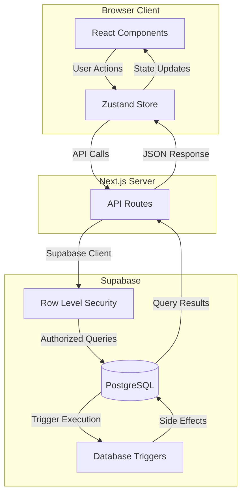
```mermaid
flowchart TB
    subgraph Client[Browser Client]
        UI[React Components]
        Store[Zustand Store]
    end
    
    subgraph Server[Next.js Server]
        API[API Routes]
    end
    
    subgraph Database[Supabase]
        DB[(PostgreSQL)]
        RLS[Row Level Security]
        Triggers[Database Triggers]
    end
    
    UI -->|User Actions| Store
    Store -->|State Updates| UI
    Store -->|API Calls| API
    API -->|Supabase Client| RLS
    RLS -->|Authorized Queries| DB
    DB -->|Trigger Execution| Triggers
    Triggers -->|Side Effects| DB
    DB -->|Query Results| API
    API -->|JSON Response| Store
```

---

## Color System Flows

### Flow 1: Browse Colors

**Trigger:** User opens Color Library Browser

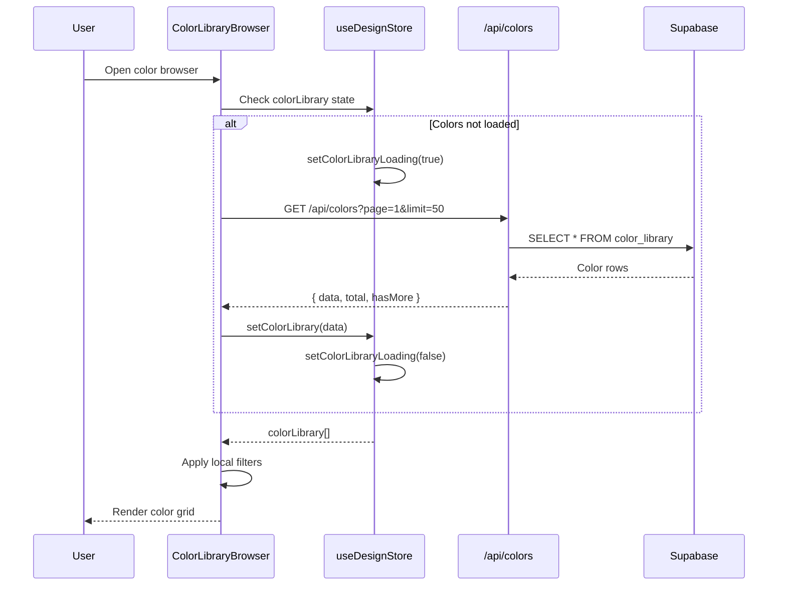
```mermaid
sequenceDiagram
    participant U as User
    participant CLB as ColorLibraryBrowser
    participant Store as useDesignStore
    participant API as /api/colors
    participant DB as Supabase
    
    U->>CLB: Open color browser
    CLB->>Store: Check colorLibrary state
    
    alt Colors not loaded
        Store->>Store: setColorLibraryLoading(true)
        CLB->>API: GET /api/colors?page=1&limit=50
        API->>DB: SELECT * FROM color_library
        DB-->>API: Color rows
        API-->>CLB: { data, total, hasMore }
        CLB->>Store: setColorLibrary(data)
        Store->>Store: setColorLibraryLoading(false)
    end
    
    Store-->>CLB: colorLibrary[]
    CLB->>CLB: Apply local filters
    CLB-->>U: Render color grid
```

### Flow 2: Search/Filter Colors

**Trigger:** User types in search or changes filter

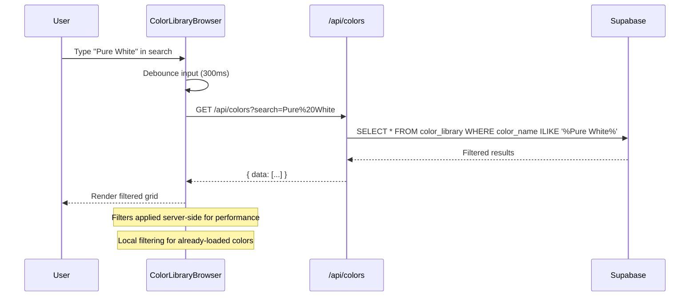
```mermaid
sequenceDiagram
    participant U as User
    participant CLB as ColorLibraryBrowser
    participant API as /api/colors
    participant DB as Supabase
    
    U->>CLB: Type "Pure White" in search
    CLB->>CLB: Debounce input (300ms)
    CLB->>API: GET /api/colors?search=Pure%20White
    API->>DB: SELECT * FROM color_library WHERE color_name ILIKE '%Pure White%'
    DB-->>API: Filtered results
    API-->>CLB: { data: [...] }
    CLB-->>U: Render filtered grid
    
    Note over CLB: Filters applied server-side for performance
    Note over CLB: Local filtering for already-loaded colors
```

### Flow 3: Select Color for Room

**Trigger:** User selects a color for a specific room surface

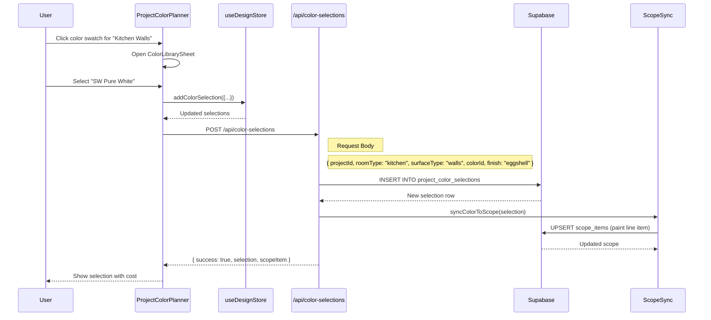
```mermaid
sequenceDiagram
    participant U as User
    participant PCP as ProjectColorPlanner
    participant Store as useDesignStore
    participant API as /api/color-selections
    participant DB as Supabase
    participant Scope as ScopeSync
    
    U->>PCP: Click color swatch for "Kitchen Walls"
    PCP->>PCP: Open ColorLibrarySheet
    U->>PCP: Select "SW Pure White"
    
    PCP->>Store: addColorSelection({...})
    Store-->>PCP: Updated selections
    
    PCP->>API: POST /api/color-selections
    Note right of API: Request Body
    Note right of API: { projectId, roomType: "kitchen", surfaceType: "walls", colorId, finish: "eggshell" }
    
    API->>DB: INSERT INTO project_color_selections
    DB-->>API: New selection row
    
    API->>Scope: syncColorToScope(selection)
    Scope->>DB: UPSERT scope_items (paint line item)
    DB-->>Scope: Updated scope
    
    API-->>PCP: { success: true, selection, scopeItem }
    PCP-->>U: Show selection with cost
```

### Flow 4: Generate Color Palette

**Trigger:** User requests palette generation from primary color

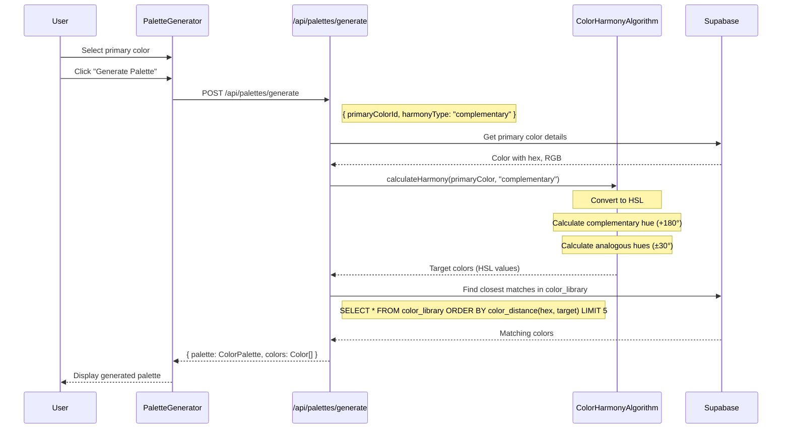
```mermaid
sequenceDiagram
    participant U as User
    participant PG as PaletteGenerator
    participant API as /api/palettes/generate
    participant Algo as ColorHarmonyAlgorithm
    participant DB as Supabase
    
    U->>PG: Select primary color
    U->>PG: Click "Generate Palette"
    
    PG->>API: POST /api/palettes/generate
    Note right of API: { primaryColorId, harmonyType: "complementary" }
    
    API->>DB: Get primary color details
    DB-->>API: Color with hex, RGB
    
    API->>Algo: calculateHarmony(primaryColor, "complementary")
    Note over Algo: Convert to HSL
    Note over Algo: Calculate complementary hue (+180°)
    Note over Algo: Calculate analogous hues (±30°)
    
    Algo-->>API: Target colors (HSL values)
    
    API->>DB: Find closest matches in color_library
    Note right of API: SELECT * FROM color_library ORDER BY color_distance(hex, target) LIMIT 5
    
    DB-->>API: Matching colors
    API-->>PG: { palette: ColorPalette, colors: Color[] }
    PG-->>U: Display generated palette
```

---

## Material System Flows

### Flow 5: Browse Materials by Category

**Trigger:** User selects material category tab

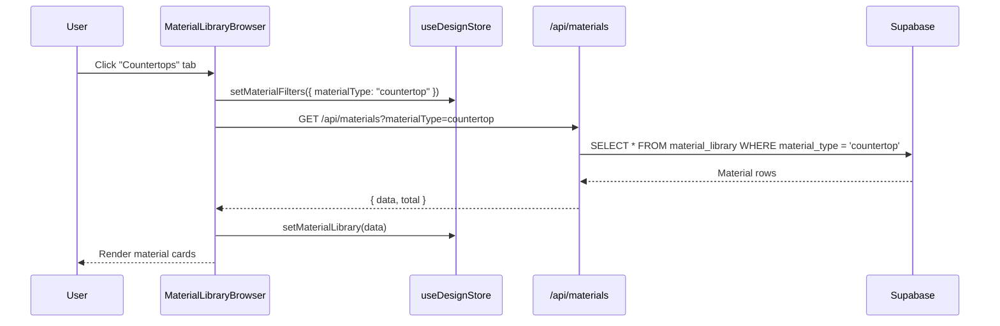
```mermaid
sequenceDiagram
    participant U as User
    participant MLB as MaterialLibraryBrowser
    participant Store as useDesignStore
    participant API as /api/materials
    participant DB as Supabase
    
    U->>MLB: Click "Countertops" tab
    
    MLB->>Store: setMaterialFilters({ materialType: "countertop" })
    MLB->>API: GET /api/materials?materialType=countertop
    API->>DB: SELECT * FROM material_library WHERE material_type = 'countertop'
    DB-->>API: Material rows
    API-->>MLB: { data, total }
    MLB->>Store: setMaterialLibrary(data)
    MLB-->>U: Render material cards
```

### Flow 6: Select Material with Quantity Calculation

**Trigger:** User selects material and enters dimensions

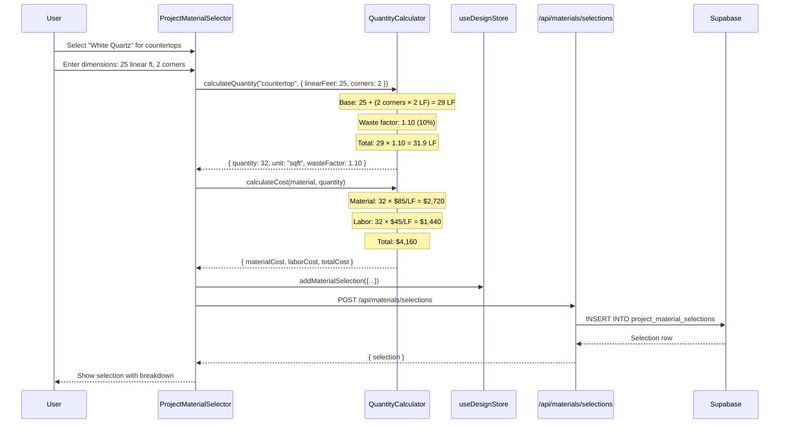
```mermaid
sequenceDiagram
    participant U as User
    participant PMS as ProjectMaterialSelector
    participant Calc as QuantityCalculator
    participant Store as useDesignStore
    participant API as /api/materials/selections
    participant DB as Supabase
    
    U->>PMS: Select "White Quartz" for countertops
    U->>PMS: Enter dimensions: 25 linear ft, 2 corners
    
    PMS->>Calc: calculateQuantity("countertop", { linearFeet: 25, corners: 2 })
    Note over Calc: Base: 25 + (2 corners × 2 LF) = 29 LF
    Note over Calc: Waste factor: 1.10 (10%)
    Note over Calc: Total: 29 × 1.10 = 31.9 LF
    Calc-->>PMS: { quantity: 32, unit: "sqft", wasteFactor: 1.10 }
    
    PMS->>Calc: calculateCost(material, quantity)
    Note over Calc: Material: 32 × $85/LF = $2,720
    Note over Calc: Labor: 32 × $45/LF = $1,440
    Note over Calc: Total: $4,160
    Calc-->>PMS: { materialCost, laborCost, totalCost }
    
    PMS->>Store: addMaterialSelection({...})
    PMS->>API: POST /api/materials/selections
    API->>DB: INSERT INTO project_material_selections
    DB-->>API: Selection row
    API-->>PMS: { selection }
    
    PMS-->>U: Show selection with breakdown
```

### Flow 7: Material to Scope Sync

**Trigger:** Material selection saved (automatic)

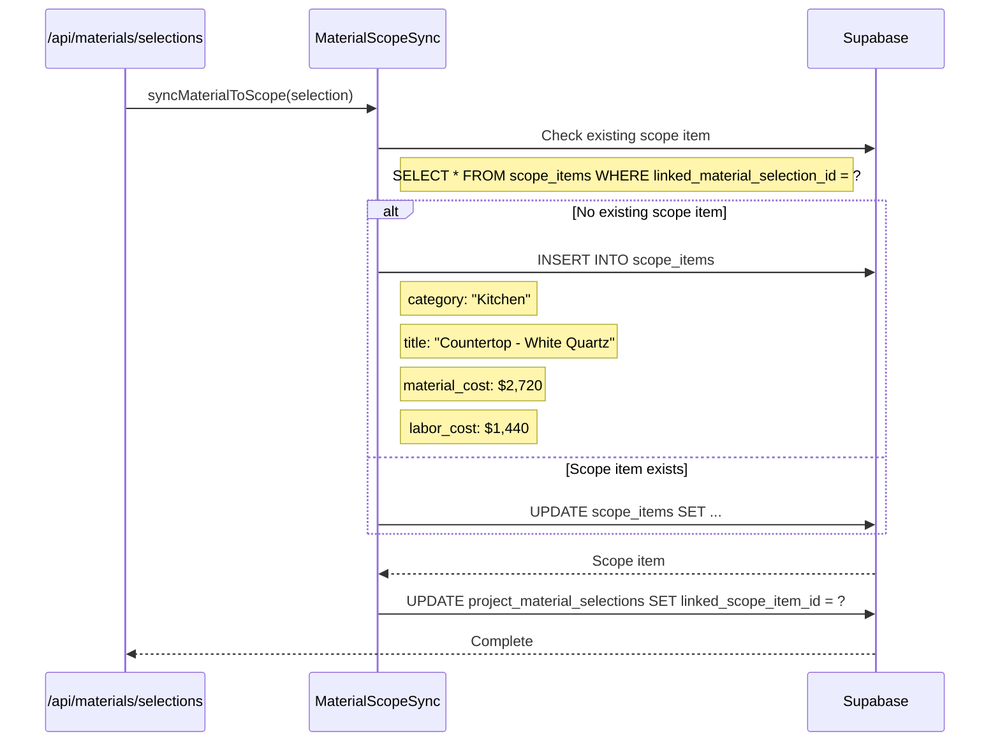
```mermaid
sequenceDiagram
    participant API as /api/materials/selections
    participant Sync as MaterialScopeSync
    participant DB as Supabase
    
    API->>Sync: syncMaterialToScope(selection)
    
    Sync->>DB: Check existing scope item
    Note right of Sync: SELECT * FROM scope_items WHERE linked_material_selection_id = ?
    
    alt No existing scope item
        Sync->>DB: INSERT INTO scope_items
        Note right of Sync: category: "Kitchen"
        Note right of Sync: title: "Countertop - White Quartz"
        Note right of Sync: material_cost: $2,720
        Note right of Sync: labor_cost: $1,440
    else Scope item exists
        Sync->>DB: UPDATE scope_items SET ...
    end
    
    DB-->>Sync: Scope item
    Sync->>DB: UPDATE project_material_selections SET linked_scope_item_id = ?
    DB-->>API: Complete
```

---

## Moodboard Flows

### Flow 8: Create New Moodboard

**Trigger:** User clicks "New Moodboard"

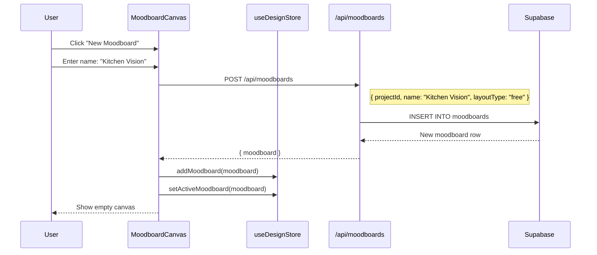
```mermaid
sequenceDiagram
    participant U as User
    participant MBC as MoodboardCanvas
    participant Store as useDesignStore
    participant API as /api/moodboards
    participant DB as Supabase
    
    U->>MBC: Click "New Moodboard"
    U->>MBC: Enter name: "Kitchen Vision"
    
    MBC->>API: POST /api/moodboards
    Note right of API: { projectId, name: "Kitchen Vision", layoutType: "free" }
    
    API->>DB: INSERT INTO moodboards
    DB-->>API: New moodboard row
    
    API-->>MBC: { moodboard }
    MBC->>Store: addMoodboard(moodboard)
    MBC->>Store: setActiveMoodboard(moodboard)
    
    MBC-->>U: Show empty canvas
```

### Flow 9: Add Element to Canvas

**Trigger:** User drags image or clicks add button

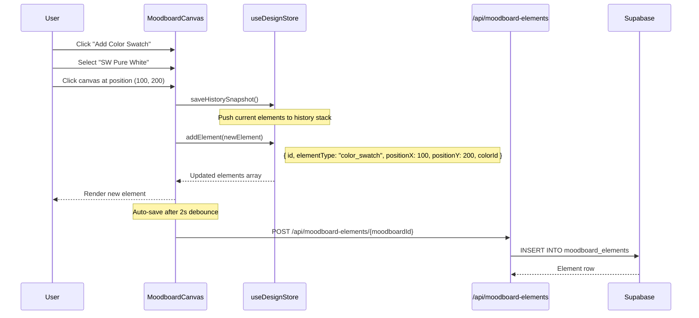
```mermaid
sequenceDiagram
    participant U as User
    participant MBC as MoodboardCanvas
    participant Store as useDesignStore
    participant API as /api/moodboard-elements
    participant DB as Supabase
    
    U->>MBC: Click "Add Color Swatch"
    U->>MBC: Select "SW Pure White"
    U->>MBC: Click canvas at position (100, 200)
    
    MBC->>Store: saveHistorySnapshot()
    Note over Store: Push current elements to history stack
    
    MBC->>Store: addElement(newElement)
    Note right of Store: { id, elementType: "color_swatch", positionX: 100, positionY: 200, colorId }
    
    Store-->>MBC: Updated elements array
    MBC-->>U: Render new element
    
    Note over MBC: Auto-save after 2s debounce
    MBC->>API: POST /api/moodboard-elements/{moodboardId}
    API->>DB: INSERT INTO moodboard_elements
    DB-->>API: Element row
```

### Flow 10: Move/Resize Element (Drag)

**Trigger:** User drags element to new position

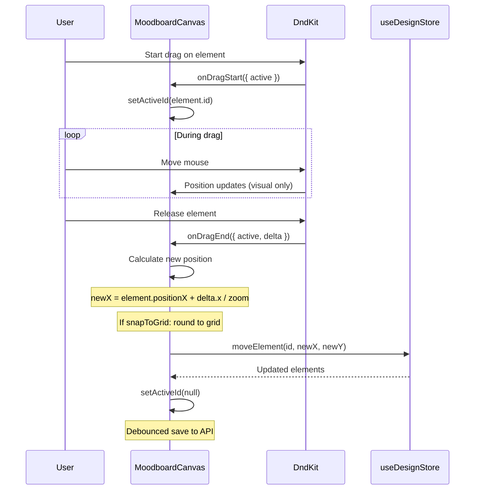
```mermaid
sequenceDiagram
    participant U as User
    participant MBC as MoodboardCanvas
    participant DnD as DndKit
    participant Store as useDesignStore
    
    U->>DnD: Start drag on element
    DnD->>MBC: onDragStart({ active })
    MBC->>MBC: setActiveId(element.id)
    
    loop During drag
        U->>DnD: Move mouse
        DnD->>MBC: Position updates (visual only)
    end
    
    U->>DnD: Release element
    DnD->>MBC: onDragEnd({ active, delta })
    
    MBC->>MBC: Calculate new position
    Note over MBC: newX = element.positionX + delta.x / zoom
    Note over MBC: If snapToGrid: round to grid
    
    MBC->>Store: moveElement(id, newX, newY)
    Store-->>MBC: Updated elements
    MBC->>MBC: setActiveId(null)
    
    Note over MBC: Debounced save to API
```

### Flow 11: Undo/Redo

**Trigger:** User presses Ctrl+Z or clicks Undo

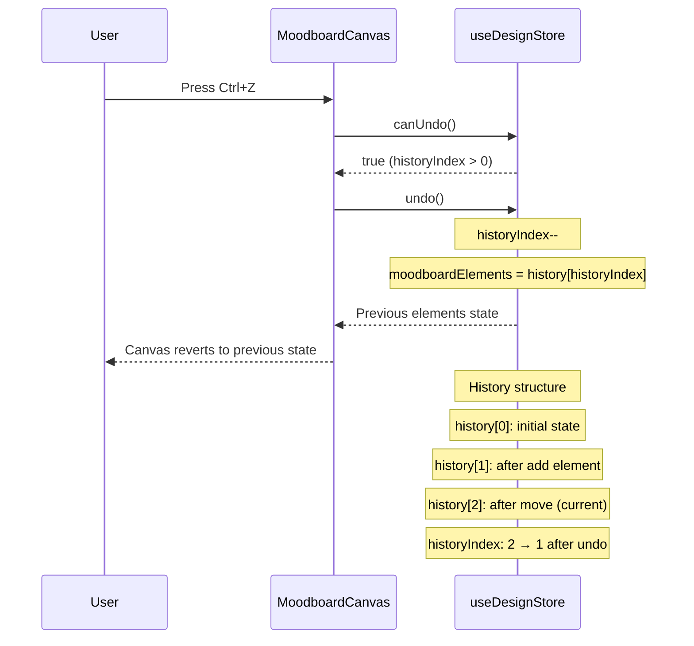
```mermaid
sequenceDiagram
    participant U as User
    participant MBC as MoodboardCanvas
    participant Store as useDesignStore
    
    U->>MBC: Press Ctrl+Z
    
    MBC->>Store: canUndo()
    Store-->>MBC: true (historyIndex > 0)
    
    MBC->>Store: undo()
    Note over Store: historyIndex--
    Note over Store: moodboardElements = history[historyIndex]
    
    Store-->>MBC: Previous elements state
    MBC-->>U: Canvas reverts to previous state
    
    Note over Store: History structure
    Note over Store: history[0]: initial state
    Note over Store: history[1]: after add element
    Note over Store: history[2]: after move (current)
    Note over Store: historyIndex: 2 → 1 after undo
```

### Flow 12: Export Moodboard to PDF

**Trigger:** User clicks Export → PDF

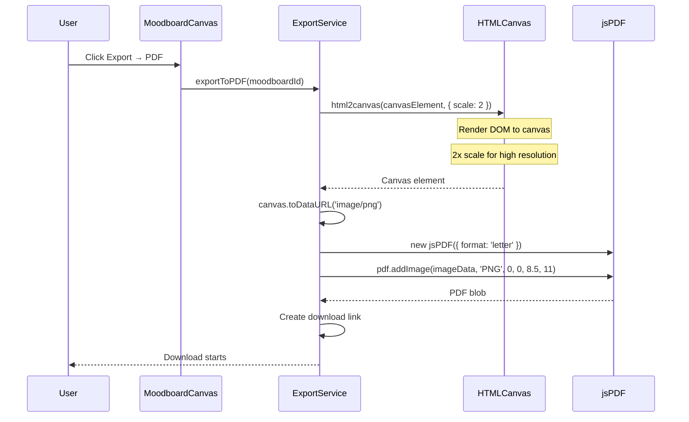
```mermaid
sequenceDiagram
    participant U as User
    participant MBC as MoodboardCanvas
    participant Export as ExportService
    participant Canvas as HTMLCanvas
    participant PDF as jsPDF
    
    U->>MBC: Click Export → PDF
    
    MBC->>Export: exportToPDF(moodboardId)
    
    Export->>Canvas: html2canvas(canvasElement, { scale: 2 })
    Note over Canvas: Render DOM to canvas
    Note over Canvas: 2x scale for high resolution
    Canvas-->>Export: Canvas element
    
    Export->>Export: canvas.toDataURL('image/png')
    
    Export->>PDF: new jsPDF({ format: 'letter' })
    Export->>PDF: pdf.addImage(imageData, 'PNG', 0, 0, 8.5, 11)
    PDF-->>Export: PDF blob
    
    Export->>Export: Create download link
    Export-->>U: Download starts
```

### Flow 13: Share Moodboard (Public Link)

**Trigger:** User clicks Share → Generate Link

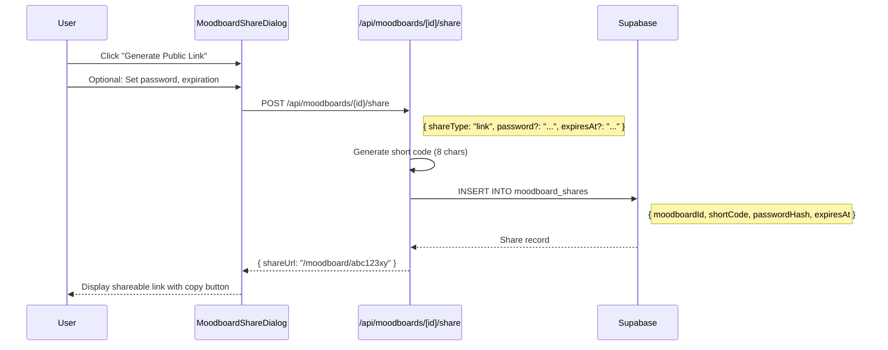
```mermaid
sequenceDiagram
    participant U as User
    participant MSD as MoodboardShareDialog
    participant API as /api/moodboards/[id]/share
    participant DB as Supabase
    
    U->>MSD: Click "Generate Public Link"
    U->>MSD: Optional: Set password, expiration
    
    MSD->>API: POST /api/moodboards/{id}/share
    Note right of API: { shareType: "link", password?: "...", expiresAt?: "..." }
    
    API->>API: Generate short code (8 chars)
    API->>DB: INSERT INTO moodboard_shares
    Note right of DB: { moodboardId, shortCode, passwordHash, expiresAt }
    
    DB-->>API: Share record
    API-->>MSD: { shareUrl: "/moodboard/abc123xy" }
    
    MSD-->>U: Display shareable link with copy button
```

---

## State Management Flows

### Zustand Store Update Pattern

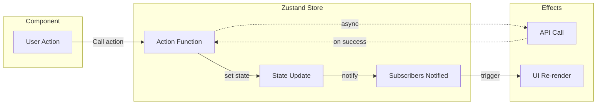
```mermaid
flowchart LR
    subgraph Component
        A[User Action]
    end
    
    subgraph Store[Zustand Store]
        B[Action Function]
        C[State Update]
        D[Subscribers Notified]
    end
    
    subgraph Effects
        E[API Call]
        F[UI Re-render]
    end
    
    A -->|Call action| B
    B -->|set state| C
    C -->|notify| D
    D -->|trigger| F
    B -.->|async| E
    E -.->|on success| B
```

### Store Initialization Flow

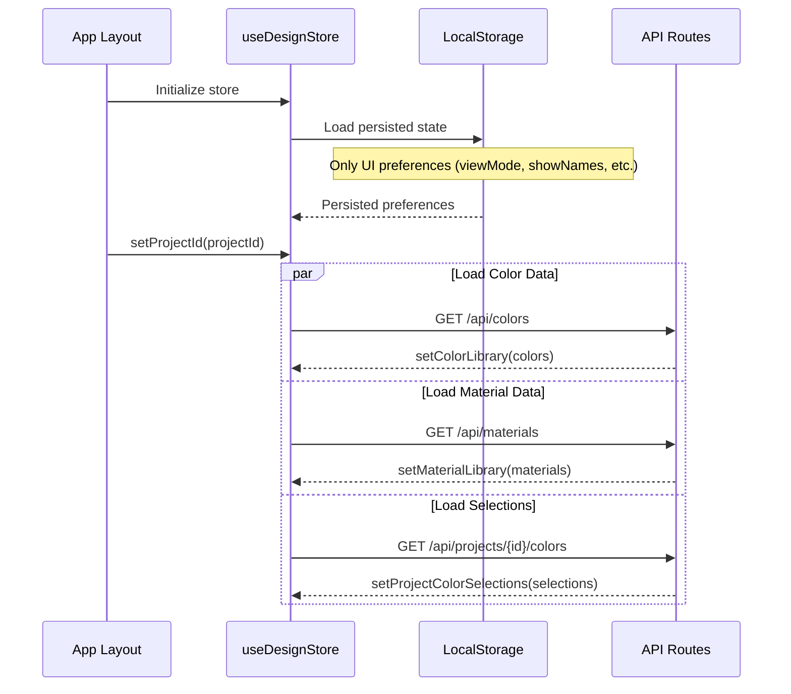
```mermaid
sequenceDiagram
    participant App as App Layout
    participant Store as useDesignStore
    participant LS as LocalStorage
    participant API as API Routes
    
    App->>Store: Initialize store
    Store->>LS: Load persisted state
    Note over LS: Only UI preferences (viewMode, showNames, etc.)
    LS-->>Store: Persisted preferences
    
    App->>Store: setProjectId(projectId)
    
    par Load Color Data
        Store->>API: GET /api/colors
        API-->>Store: setColorLibrary(colors)
    and Load Material Data
        Store->>API: GET /api/materials
        API-->>Store: setMaterialLibrary(materials)
    and Load Selections
        Store->>API: GET /api/projects/{id}/colors
        API-->>Store: setProjectColorSelections(selections)
    end
```

---

## API Request Flows

### Standard API Request Pattern

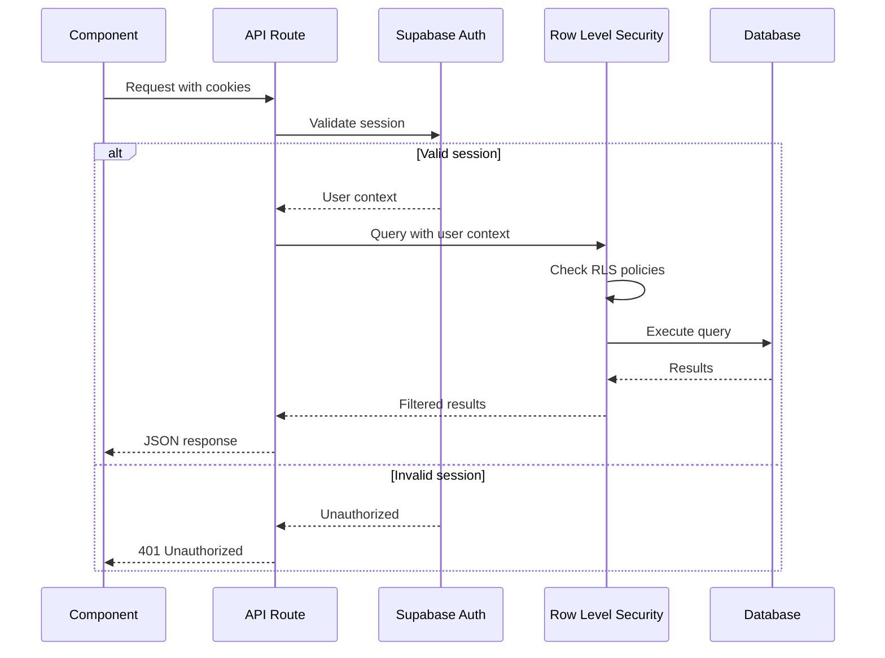
```mermaid
sequenceDiagram
    participant C as Component
    participant API as API Route
    participant Auth as Supabase Auth
    participant RLS as Row Level Security
    participant DB as Database
    
    C->>API: Request with cookies
    API->>Auth: Validate session
    
    alt Valid session
        Auth-->>API: User context
        API->>RLS: Query with user context
        RLS->>RLS: Check RLS policies
        RLS->>DB: Execute query
        DB-->>RLS: Results
        RLS-->>API: Filtered results
        API-->>C: JSON response
    else Invalid session
        Auth-->>API: Unauthorized
        API-->>C: 401 Unauthorized
    end
```

### Error Handling Flow

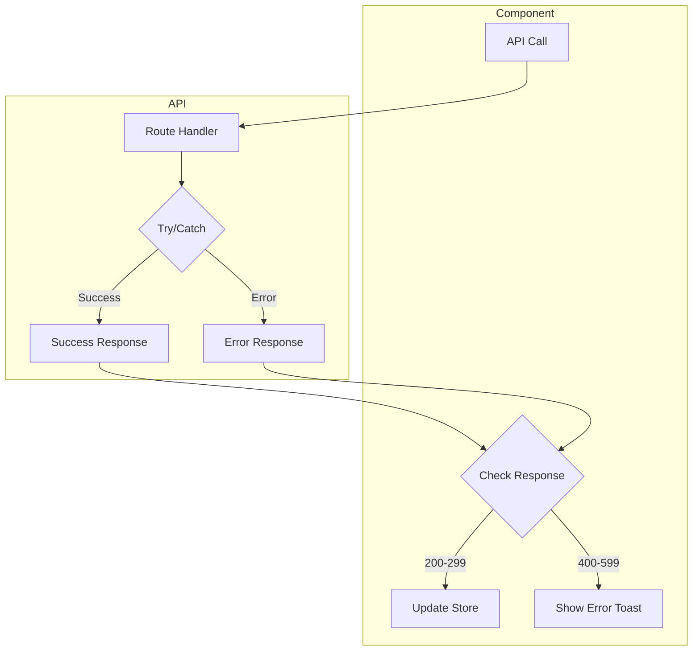
```mermaid
flowchart TB
    subgraph Component
        A[API Call]
        B{Check Response}
        C[Update Store]
        D[Show Error Toast]
    end
    
    subgraph API
        E[Route Handler]
        F{Try/Catch}
        G[Success Response]
        H[Error Response]
    end
    
    A --> E
    E --> F
    F -->|Success| G
    F -->|Error| H
    G --> B
    H --> B
    B -->|200-299| C
    B -->|400-599| D
```

---

## Database Trigger Chains

### Color Selection Trigger Chain

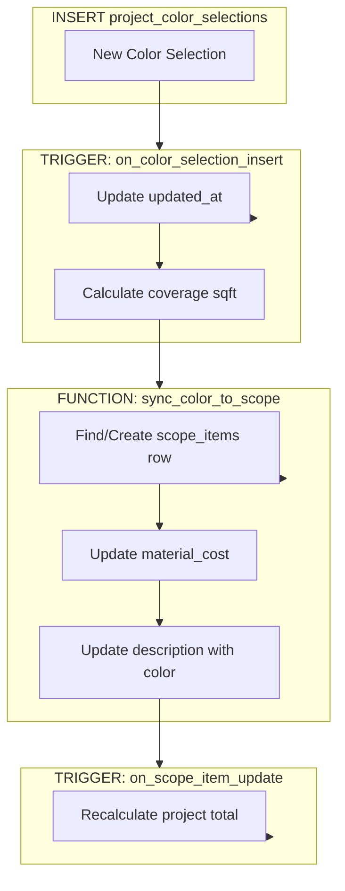
```mermaid
flowchart TB
    subgraph Insert[INSERT project_color_selections]
        A[New Color Selection]
    end
    
    subgraph Trigger1[TRIGGER: on_color_selection_insert]
        B[Update updated_at]
        C[Calculate coverage sqft]
    end
    
    subgraph Function1[FUNCTION: sync_color_to_scope]
        D[Find/Create scope_items row]
        E[Update material_cost]
        F[Update description with color]
    end
    
    subgraph Trigger2[TRIGGER: on_scope_item_update]
        G[Recalculate project total]
    end
    
    A --> Trigger1
    Trigger1 --> B
    B --> C
    C --> Function1
    Function1 --> D
    D --> E
    E --> F
    F --> Trigger2
    Trigger2 --> G
```

### Moodboard Element Z-Index Normalization

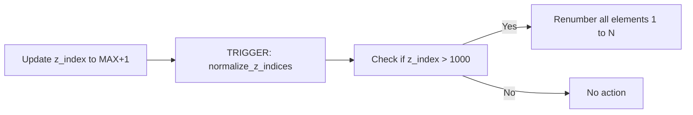
```mermaid
flowchart LR
    A[Update z_index to MAX+1] --> B[TRIGGER: normalize_z_indices]
    B --> C[Check if z_index > 1000]
    C -->|Yes| D[Renumber all elements 1 to N]
    C -->|No| E[No action]
```

---

## Quick Reference: Common Flows

### When User Selects a Color

1. `ColorLibrarySheet` → User clicks color
2. `onColorSelect` callback fired
3. `addColorSelection` action called
4. Store updates `projectColorSelections`
5. API POST creates database record
6. `syncColorToScope` updates scope items
7. Component re-renders with new selection

### When User Adds Moodboard Element

1. `MoodboardToolbar` → User clicks "Add Image"
2. `onElementCreate` callback fired
3. `saveHistorySnapshot` captures current state
4. `addElement` action called
5. Store updates `moodboardElements`
6. Debounced API POST saves to database
7. Canvas re-renders with new element

### When User Exports PDF

1. `MoodboardShareDialog` → User clicks "Download PDF"
2. `exportToPDF` service function called
3. `html2canvas` captures canvas as image
4. `jsPDF` creates PDF document
5. Browser downloads file

---

## Related Documentation

- [Component Architecture](./COMPONENT_ARCHITECTURE.md) - Component structure
- [Integration Sequences](./INTEGRATION_SEQUENCES.md) - Build order
- [API Endpoints](../reference/API_ENDPOINTS.md) - Route specifications
- [Troubleshooting Guide](../testing/TROUBLESHOOTING_GUIDE.md) - When flows break

